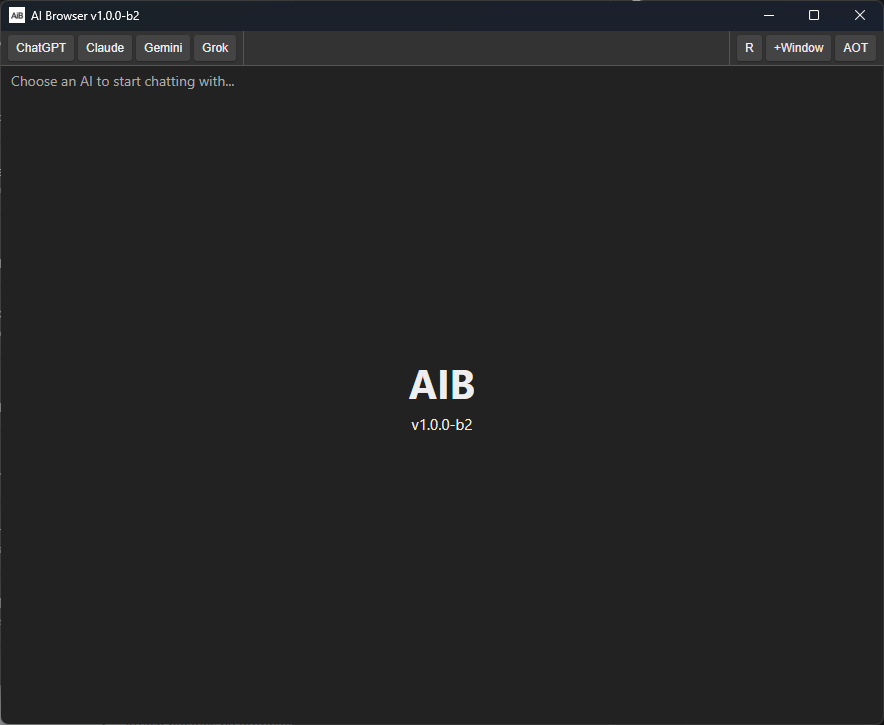

# AIB - AI Browser v1.0.0-b2

## Description
AIB is a desktop application that provides a convenient way to access various AI services in a tabbed browser interface. It offers a simple, clean interface optimized for AI interactions.

## Screenshot

## Features
- Simple, clean interface optimized for AI interactions
- Support for multiple services:
  - ChatGPT (chat.openai.com)
  - Claude (claude.ai)
  - Google Gemini (gemini.google.com)
  - Grok (grok.com)
- Tab-based browsing with the ability to open multiple AI services at once
- "Always on top" mode to keep the application visible while working in other windows
- Ability to launch multiple instances of the application
- Chrome 134 user-agent for optimal compatibility with AI services

## Download
[Download AIB_Installer-v1.0.0-b2.exe](https://github.com/AnRkey/AIB/releases/download/v1.0.0-b2/AIB_Installer-v1.0.0-b2.exe)

[Download AIB_Portable-v1.0.0-b2.exe](https://github.com/AnRkey/AIB/releases/download/v1.0.0-b2/AIB_Portable-v1.0.0-b2.exe)

[Download AIB_Portable-v1.0.0-b2.zip](https://github.com/AnRkey/AIB/releases/download/v1.0.0-b2/AIB_Portable-v1.0.0-b2.zip)

## Prerequisites for use
- Windows 10 or 11
- Internet connection
- Accounts for the AI services you wish to use

## Prerequisites for building
- Windows 10 or 11
- Internet connection
- Node.js 14+ 
- npm or yarn

## Project Structure
- `src/` - Contains the main Electron application code
  - `main.js` - Main Electron process
  - `preload.js` - Preload script for the renderer process
  - `renderer.js` - Renderer process code
  - `custom-tabs.js` - Custom tabs implementation
  - `AIB.ico` - Application icon
  - `AIB_logo.png` - Application logo
  - `AIB_background.jpg` - Background image for welcome screen
- `index.html` - Main application HTML (fully documented with comments)
- `styles.css` - Application styles
- `build.bat` - Build script for Windows
- `docs/` - Project documentation
  - `user-guide.md` - User guide and instructions
  - `developer-guide.md` - Developer documentation
  - `architecture.md` - Architecture overview

## Documentation
The project includes comprehensive documentation in the `docs/` directory:

- **User Guide**: Instructions for installing and using the application
- **Developer Guide**: Information for developers who want to contribute or modify the code
- **Architecture Overview**: Explanation of the application's structure and design principles

For more details, see the [documentation](docs/).

## Build AIB
1. Install Node.js from [nodejs.org](https://nodejs.org/).
2. Clone this repository or download the files.
3. Install dependencies with `npm install`
4. Run the application with `npm start`
5. Build with `npm run build`

The build process will:
- Clean previous build files
- Create the build directory
- Install project dependencies if needed
- Build the application
- All build outputs will be placed in the `build` directory.

## Usage
- Click on any AI service button in the left sidebar to open it in the current tab or create a new tab
- Use the "+" button in the tab bar to create a new tab
- Toggle "Always on top" to keep the window visible on top of other applications
- Click the "+ Instance" button to open a new instance of the application

## Support
Need help? Found a bug? Have a feature request? Please submit an issue on GitHub:

When submitting an issue, please include:
1. Your operating system version
2. Application version you're using
3. Detailed steps to reproduce the problem
4. Screenshots if applicable
5. Any error messages you received

This helps me address your problem more efficiently. You can also check if your issue has already been reported by browsing the [existing issues](https://github.com/AnRkey/AIB/issues).

## Feedback
Your feedback is valuable and helps improve AIB! Here are ways to provide feedback:

- **Feature Requests**: Have an idea to make AIB better? [Submit a feature request](https://github.com/AnRkey/AIB/issues/new?labels=enhancement&template=feature_request.md&title=%5BFEATURE%5D) on GitHub.
- **General Feedback**: For general comments, suggestions, or experiences using the application, you can:
  - Send an email to anrkey@gmail.com with the subject "AIB Feedback"
  - Leave a comment on the [releases page](https://github.com/AnRkey/AIB/releases)

All feedback is reviewed and considered for future updates. Thank you for helping make AIB better!

## License
This project is licensed under the GNU General Public License version 2.0 (GPL-2.0). See the [LICENSE](LICENSE) file for details.

## Contact
Contact an R key at anrkey@gmail.com

## Disclaimer
This app is not affiliated with any of the AI services it provides access to. It is simply a browser interface for accessing these services.

## Copyright Notice
The application icons and logos are either created for this project or found online.
If you are from any of the AI companies and if my use of any artwork is a problem, please let me know and I'll remove it.

## Contributing
See [CONTRIBUTING.md](CONTRIBUTING.md) for details on how to contribute to this project.